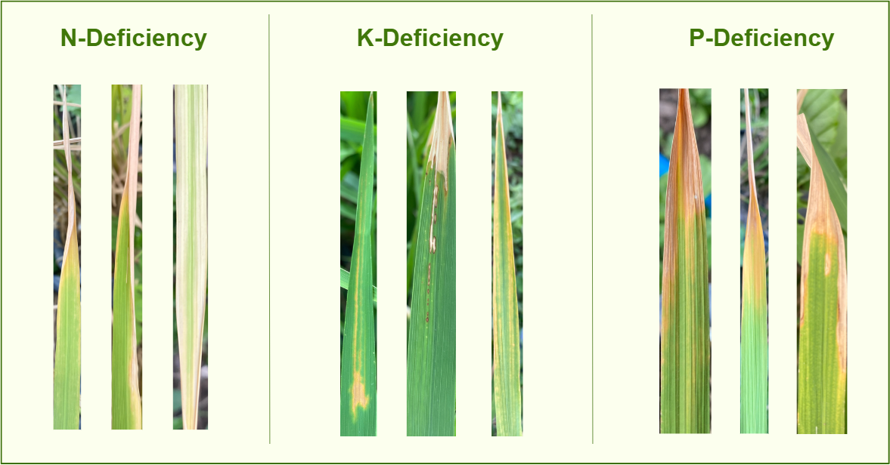
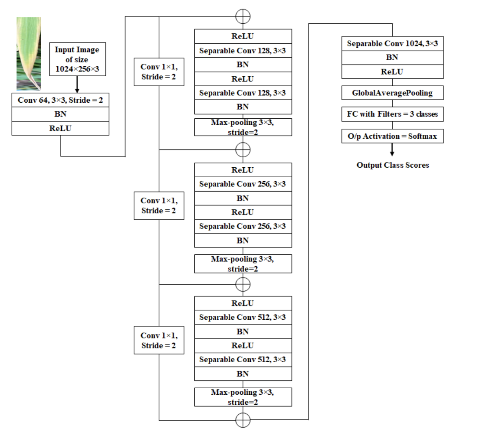

# Rice Leaf Nutrient Deficiency Classification 🌱


## 📌 Overview
A deep learning-based classification system designed to identify nutrient deficiencies (Nitrogen - N, Phosphorus - P, Potassium - K) in rice leaves. This project benchmarks state-of-the-art (SOTA) CNN architectures (MobileNetV3, EfficientNet) against a custom, lightweight **MiniXception** model. It also explores integrating an **Efficient Channel Attention (ECA)** module, optimizing the architecture for edge device deployment in smart agriculture.

## 🖼️ Visual Demo

* **Nutrient Deficiency Classes (N, P, K):**
  

* **Proposed MiniXception Architecture:**
  

## 📊 Dataset
The project utilizes the **"Nutrient-Deficiency-Symptoms-in-Rice"** dataset.
* **Total Images:** 1,156 high-resolution RGB cropped images.
* **Class Distribution:**
  * **Nitrogen (N):** 440 images (~38.1%) - *Symptoms: Yellowing of leaves.*
  * **Phosphorus (P):** 333 images (~28.8%) - *Symptoms: Purplish-red hues at the leaf base.*
  * **Potassium (K):** 383 images (~33.1%) - *Symptoms: Yellow-brown spots / necrotic leaf margins.*
* **Source:** [Kaggle Dataset](https://www.kaggle.com/datasets/guy007/nutrientdeficiencysymptomsinrice)

## ⚙️ Methodology & Tech Stack
* **Framework:** PyTorch.
* **Preprocessing:** Images resized to `1024x256` (4:1 aspect ratio to match leaf morphology), ImageNet normalization, and robust data augmentation (Horizontal Flip, Rotation ±20°, Affine transformations) applied strictly to the training set to mitigate overfitting.
* **Architectures Evaluated:**
  * **Transfer Learning Baselines:** MobileNetV3-Large, EfficientNet-B0, and original Xception.
  * **Custom Edge Model:** Designed a **MiniXception** network using Depthwise Separable Convolutions to drastically reduce parameters. Integrated an **Efficient Channel Attention (ECA)** module to focus learning weights on pathological regions (e.g., yellowing, brown spots) with a negligible cost of ~2K additional parameters.

## 📈 Results & Benchmarking
All models were rigorously evaluated using **Stratified 5-Fold Cross-Validation**.

| Model | Parameters (M) | Average Accuracy (%) | Train Time (1 Epoch) |
| :--- | :---: | :---: | :---: |
| **MobileNetV3-Large** | 4.21 | **96.21** | **17.53s** |
| EfficientNet-B0 | 4.01 | 95.69 | 17.87s |
| MiniXception (Custom Base) | 1.24 | 95.34 | 20.40s |
| Xception (Original) | 20.81 | 95.00 | 19.84s |
| **MiniXception + ECA** | **1.24** | 94.83 | 21.34s |

> **💡 Key Insights:**
> * While **MobileNetV3-Large** achieved the highest accuracy, our custom **MiniXception variants** demonstrated immense potential for **Edge AI**. 
> * By maintaining a highly competitive accuracy (~95%) while being **nearly 4x smaller** than SOTA models (1.24M vs 4.21M params), the custom MiniXception base model is highly suitable for deployment on low-resource mobile devices.
> * *Challenge:* Analysis of wrong predictions indicated occasional misclassification between Phosphorus (P) and Potassium (K) classes due to overlapping necrotic symptoms (e.g., leaf margin burning) in severe stages.

## 🚀 Installation & Usage
The project is organized into standalone Jupyter Notebooks for clarity and reproducibility.

**1. Clone the repository**
```bash
git clone [https://github.com/bavuong2005/rice-leaf-nutrient-classification.git](https://github.com/bavuong2005/rice-leaf-nutrient-classification.git)
cd rice-leaf-nutrient-classification
```

**2. Install dependencies**
```bash
pip install torch torchvision numpy pandas matplotlib scikit-learn
```

**3. Run the notebooks**
```bash
jupyter notebook
```

## 📁 Repository Structure
```text
rice-leaf-nutrient-classification/
│
├── 01_MiniXception.ipynb                # Training & Evaluation: Custom MiniXception
├── 02_MiniXception_ECA_Attention.ipynb  # Training & Evaluation: MiniXception + ECA
├── 03_Xception_Original.ipynb           # Baseline: Original Xception
├── 04_MobileNetV3_Large.ipynb           # Baseline: MobileNetV3-Large
├── 05_EfficientNet_B0.ipynb             # Baseline: EfficientNet-B0
│
├── README.md                            # Project documentation
└── requirements.txt                     # Dependencies
```

## 🔮 Future Work
* **Mobile Deployment:** Port the optimal lightweight model (MiniXception or MobileNetV3) to an Android/iOS application for real-time field diagnosis.
* **Object Detection:** Transition from image classification to Object Detection (e.g., YOLO) to precisely localize necrotic lesions on leaves.
* **Data Diversity:** Collect a broader range of field data under varying lighting conditions to resolve the P vs. K classification bottleneck.
```
